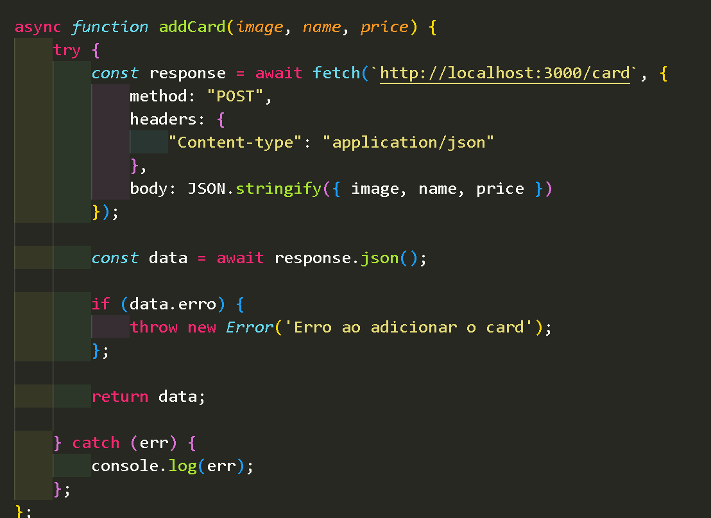
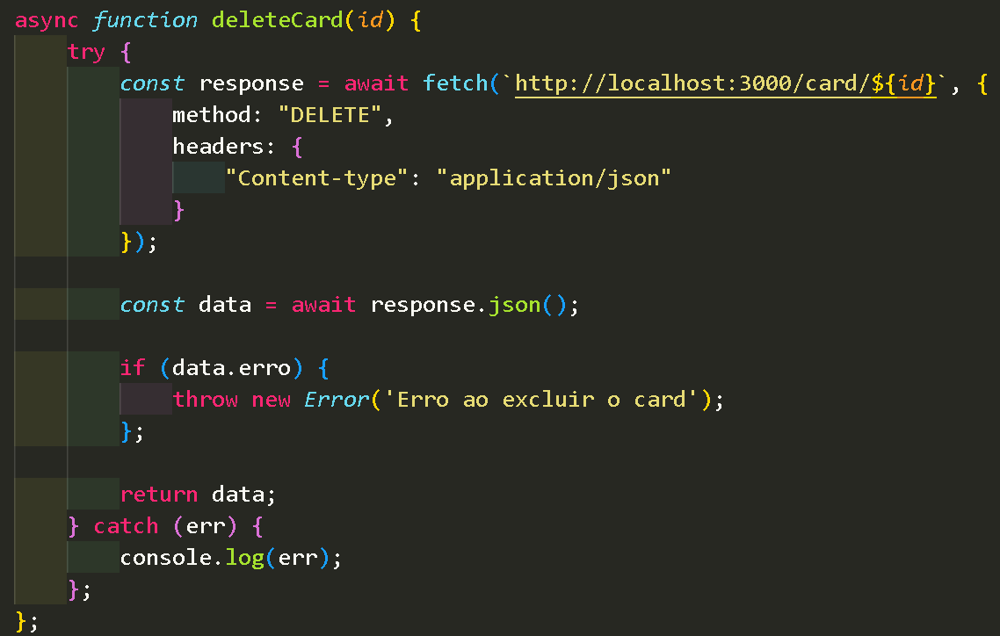

# AluraGeek

Este é o meu projeto desenvolvido no desafio da Alura de FrontEnd.
O principal objetivo dele foi criar um `Mokup` para simular um API <i>fake</i> e poder cosumi-la utilizando métodos distintos, que foram os métodos `GET`, `POST` e `DELETE`.
<br>

Neste projeto, você pode adicionar novos itens a lista. Para isso, basta preencher todos o campos do formulário para adicionar um novo card. No formulário você só precisa adicionar o nome do produto, o preço e a url da imagem.
<br>

Você também pode excluir cada card, individualmente, ao clicar no botão que cada item possui no canto inferior direito do próprio card.

## Principais Desafios

Até então, nunca tinha trabalhado com os métodos `POST` e `DELETE`.

Para o método POST, além de criar a função assícrona para consumi-la, também precisei editar mais algumas configurções. Como por exemplo, o método que iremos consumir, especificamos no `headers` o tipo de arquivo que está sendo enviado e no `body` adicionamos os dados que queremos cadastrar na requisição.



<br>

Já função assícrona para para excluir produtos, além de configurar o método `DELETE`, e determinar o tipo de arquivo a ser excluído, foi necessário adicionar um parâmetro `id` para poder criar o evento de exclusão de cada card individualmente.



## ⌨️ Como Utilizar O Servidor Local

1. Você precisa ter o **Node.js** instalado;

2. Clone este repositório executando o comando abaixo;

   ```
   git clone https://github.com/Moiseis-Cruz/AluraGeek.git
   ```

3. Navegue ao diretório do projeto. Indo até a pasta raiz do projeto;

   ```
   cd AluraGeek
   ```

4. Instale as dependências;

   ```
   npm install
   ```

5. Inicie o servidor json;

   ```
   npm start
   ```

6. Abra o arquivo `index.html` no seu navegador;

## 🛠️ Tecnologias Utilizadas

- HTML;
- CSS;
- JavaScript (JS);
- json-server;


